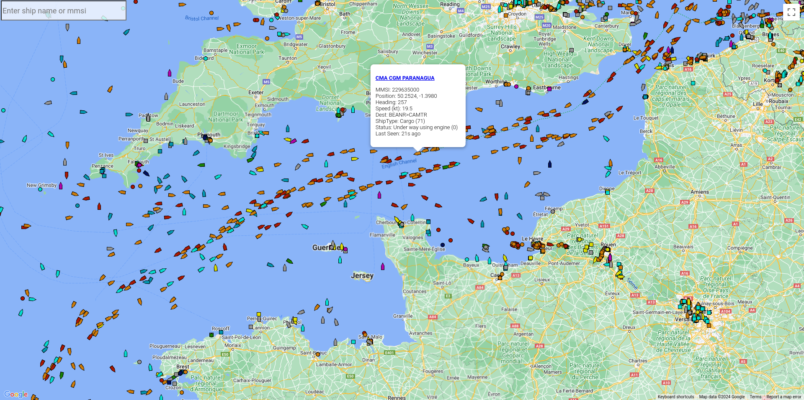
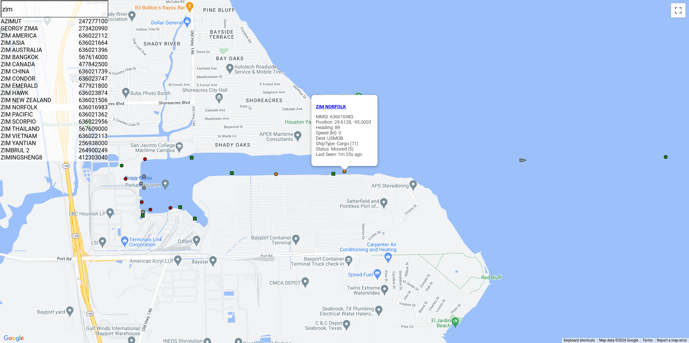

## Sea Spy

Visualize and track the world fleet based on aisstream.io's global feed of Automatic Identification System (AIS) data.

### Objective

Sea Spy is designed to track hundreds of thousands of vessels via Google Maps without marker clustering or zoom level density filtering. In addition to the world fleet, Sea Spy can be leveraged to track personal fleets via aisstream.io's subscription filtering options.



Vessel Search


Vessel Timelapse (Tile Refresh)

https://github.com/bbailey1024/seaspy/assets/5913377/78464924-db4d-49d1-a0c7-b93c09ad9c06

### Installation

1. Generate API Keys
   * [Google Maps](https://developers.google.com/maps/documentation/javascript/get-api-key)
   * [aisstream.io](https://aisstream.io/authenticate)

2. Build Sea Spy
   ```bash
   git clone https://github.com/bbailey1024/seaspy.git
   cd seaspy
   go build .
   ```
   Checkout the [releases page](https://github.com/bbailey1024/seaspy/releases) for available binaries.

3. Configure Sea Spy
   * Create a configuration file from an example found in doc/config/
   * Add API keys to seaspy.json
   * Adjust aisstream subscription (default is world fleet)
   * See [aisstream documentation](https://aisstream.io/documentation#Connection-Subscription-Parameters) on bounding boxes and mmsi filters
   * Adjust swabby values to prune ships that have not been updated within that time period and the duration of ship route history data to store

4. Run Sea Spy
   ```bash
   ./seaspy -c seaspy.json
   ```

5. Verify Sea Spy is running
   * Open your browser
   * Navigate to [http://127.0.0.1:8080](http://127.0.0.1:8080).

### Known Issues
* Slow close on SIGINT when stream volume is very low

   The aisstream go routine may take up to HEARTBEAT_TIMEOUT+HEARTBEAT_INTERVAL seconds to close if the volume of the aisstream feed is very low. This is due to the select within aisstream.ConnectAndStream waiting for a Read to complete. When no traffic is present, that Read will complete on heartbeat interval. Won't fix as it's not a bug and could be alleviated with a shorter heartbeat interval or SIGKILL if the program must be closed immediately.

### Potential Roadmap
* Filter buttons (Ship Type, No Names, Last Seen, etc)
* Implement additional AIS message types and associated features (Currently only position report and ship static data messages are utilized)
